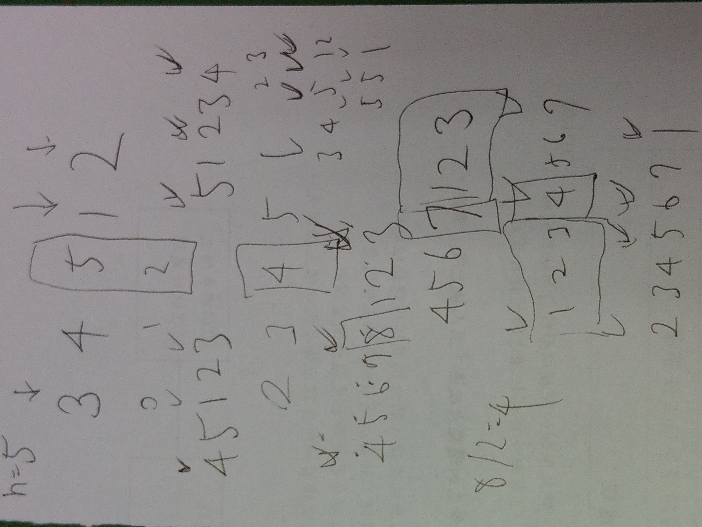

## 153. Find Minimum in Rotated Sorted Array (Medium)

[題目連結](https://leetcode.com/problems/find-minimum-in-rotated-sorted-array/)

本題耗時：18分33秒

### 我的解題思路

<p float="left">
  
</p>

- 題目要求演算法要 runs in `O(log n)` time，就立刻猜想說會許能用 `binary search` 的概念去解
- 試著在 array 上標註 `left`、`right`、`mid`，然後去模擬找到最小值的方法，過程中會慢慢找到規律

### C++

```cpp
// 2021-08-31 星期二
// Runtime: 4 ms (60.45%)
// Memory Usage: 10.1 MB (96.05%)

class Solution {
public:
    int findMin(vector<int>& nums) {
        
        int left = 0;
        int right = nums.size() - 1;
        
        while (true) {
            int mid = (left + right) / 2;
            
            if (nums[left] <= nums[mid] && nums[mid] <= nums[right]) {
                return nums[left];
            }
            
            if (right - left == 1) {
                return min(nums[left], nums[right]);
            }

            if (nums[left] <= nums[mid]) {
                left = mid;
            } else if (nums[mid] <= nums[right]) {
                right = mid;
            }
        }
        
        
    }
};
```