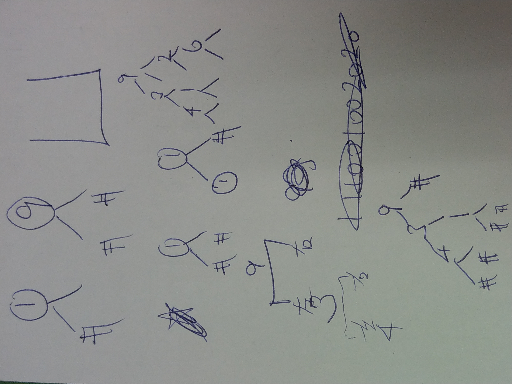
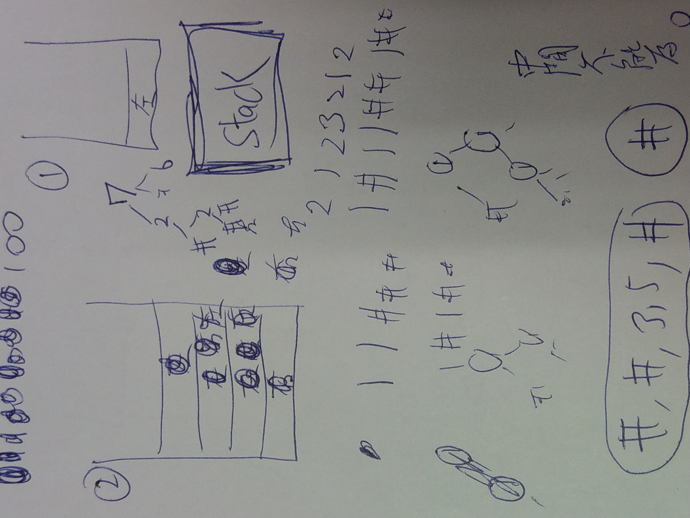

## 331. Verify Preorder Serialization of a Binary Tree (Medium)

[題目連結](https://leetcode.com/problems/verify-preorder-serialization-of-a-binary-tree/)

### 我的解題思路

<p float="left">
  
  
</p>

- 憑空想像實在困難，所以後來就決定拿紙來構思（有紙沒紙差超多）
- 做這題的時候其實把 `preorder traversal` 忘得差不多了，也想試著不去 google 自己想辦法回憶起來，在紙上畫了畫以後，好像有點概念了
- 拜訪順序：父節點 &rarr; 左子節點 &rarr; 右子節點，一直先往下挖，直到遇到 `#`，畫了畫，發現可以運用 `stack` 的概念去達成這個部分（而且最末端一定都是 `#`）
- 後來發現節點上的數字不是重點，本題只需關注 `non-null` 和 `null` 這兩種而已，所以我就分別用 `1` 和 `0` 簡化表示方式，並去構思下一步
- 本題雖然蘊含 `stack` 的概念，但我沒用它下去解，而是用我觀察到的規律(?)，然後設個記錄 stack 中元素個數的一個變數 `numStackElement` 為 1（不設 0 是為了解決開頭的 `non-null`）
  1. `,` 代表 `non-null`，因為 `non-null` 後面都會出現 `,`（遇到 `#` 會多跳一個，所以不會遇到 `,`）
  2. 大概像右圖那樣，`non-null` 就在 stack 中 push 進兩個節點（若不是開頭的 `non-null`，在 push 前，還必須先 pop 一個節點，因為它佔去了一個節點名額）也就是說：開頭 &rarr; 直接 +2，非開頭 &rarr; -1+2，但因為 numStackElement 的初始值為 1 而非 0，所以我的方法開頭一樣要先 -1 再 +2，這樣大家都統一了！
  3. 遇到 `#` 就直接 -1（佔去了一個節點名額，且不會延伸新的節點）
  4. 當 `preorder` 都 run 完以後，numStackElement 為 0 就代表是正確的

### Corner Cases

有些搞不好不是，只是在解題過程中疏忽了

1. 只有一個 `#` 時為 `true`（代表是空的 binary tree）
2. 開頭是 `#` 但後面還有其他東西時為 `false`（null 節點怎能延伸出左子節點、右子節點）
3. 中間不能為 0，因為「為 0」代表說已經滿了（也就是所有末端都已塞滿 `#`），這樣就如同第二點，後續就不可能再延伸出子節點

### C++

```cpp
// 2021-08-27 星期五
// Runtime: 2 ms (80.17%)
// Memory Usage: 6.7 MB (81.84%)

class Solution {
public:
    bool isValidSerialization(string preorder) {
        
        // corner cases
        if (preorder.size() == 1 && preorder[0] == '#') {
            return true;
        } else if (preorder[0] == '#') {
            return false;
        }
        
        int numStackElement = 1;
        int n = preorder.size();
        
        for (int i = 0; i < n; ++i) {
            
            if (numStackElement == 0) {
                // cannot be 0 during the process
                // 0 means there's no more opportunity to add a new node
                return false;
            }
            
            if (preorder[i] == ',') {
                numStackElement++;
            } else if (preorder[i] == '#') {
                numStackElement--;
                i++;   // to skip the next comma
            }
        }
        
        // the last possible non-null node
        if (preorder[n - 1] != '#') {
            numStackElement++;
        }
        
        return numStackElement == 0;
        
    }
};
```

### 收穫

解題前應該要先多去想可能會有的 corner cases (edge cases)，不要覺得說自己「以為的」一定毫無遺漏之處，這題我提交到第六次才 Accepted⋯⋯

幸好 LeetCode 會告訴你某筆沒通過測資它的 `Input`、`Output`、`Expected`，不然可能會花更多時間在 debug 上！

### 可能對未來解題有幫助

1. 在 C++ 中如何不用 loop 數 string 中某 char 出現的次數？
    ```cpp
    #include <algorithm>   // count
    
    string s = "a_b_c";
    int n = count(s.begin(), s.end(), '_');

    // 也能 count elements in array or container
    ```
2. C++ 類似 Python 的 `split()` 那樣，用某 char 來 split 一個 string
    ```cpp
    // --- istream& getline (istream& is, string& str, char delim); ---
    // Extracts characters from is and stores them into str
    // until the delimitation character delim is found
    
    #include <sstream>   // stringstream

    vector<string> result;

    void split(string s, char delim) {
        stringstream ss(s);
        string tok;
        while (getline(ss, tok, delim)) {
            result.push_back(tok);
        }s
    }

    string test = "ewf,wef,wef,#,#,ewf";
    split(test, ',');
    // result: [ewf, wef, wef, #, #, ewf]
    ```