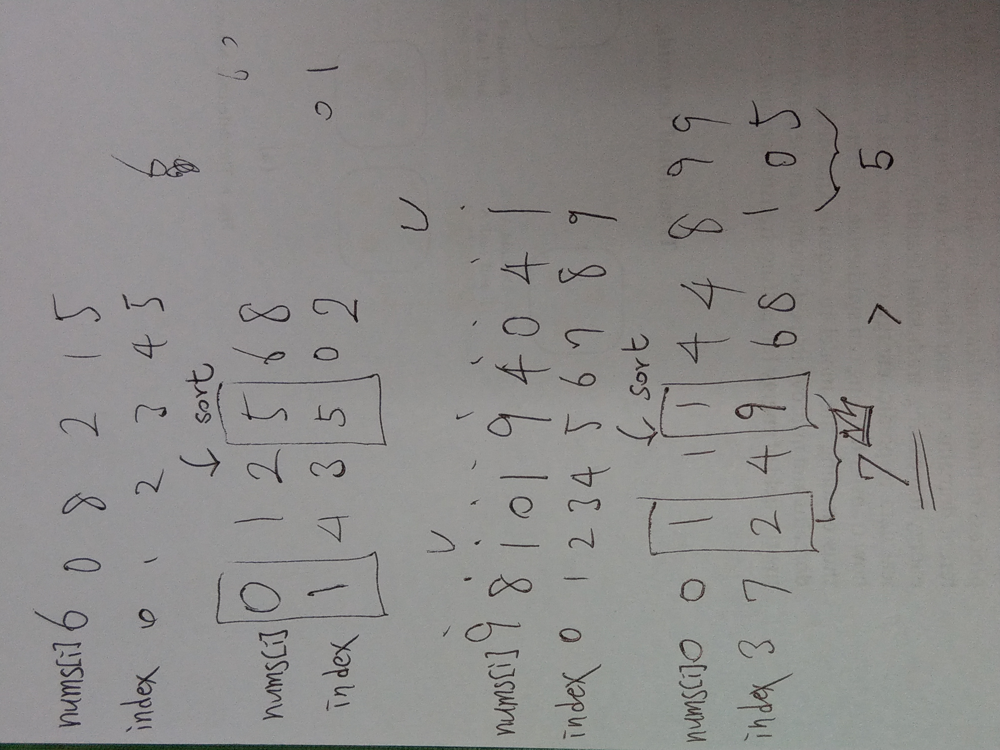

## 962. Maximum Width Ramp (Medium)

[題目連結](https://leetcode.com/problems/maximum-width-ramp/)

本題耗時：18分02秒

### 我的解題思路

<p float="left">
  
</p>

1. 因為 `nums[i] <= nums[j]`，所以先對 `nums` 做由小排到大的排序，加上題目要求的 `width` 涉及到 index，所以在排序之前，我先用 `pair` 把數值、index 兩者都包在一起（放進 `v`），若 `nums[i] == nums[j]` 時，則用 `i < j` 的方式去排序
2. 盡可能找出最大的 index 差

### C++

```cpp
// 2021-09-13 星期一
// Runtime: 160 ms (5.11%)
// Memory Usage: 33.8 MB (13.05%)

class Solution {
public:
    int maxWidthRamp(vector<int>& nums) {
        
        vector<pair<int, int> > v;
        pair<int, int> temp;
        
        for (int i = 0; i < nums.size(); ++i) {
            temp = make_pair(nums[i], i);
            v.push_back(temp);
        }
        
        sort(v.begin(), v.end(), cmp);
        
        int smallestIndex = nums.size();
        int maxWidth = 0;
        
        for (int i = 0; i < nums.size(); ++i) {
            if (v[i].second < smallestIndex) {
                smallestIndex = v[i].second;
            }
            if (v[i].second - smallestIndex > maxWidth) {
                maxWidth = v[i].second - smallestIndex;
            }
        }
        
        return maxWidth;
        
    }
    
    static bool cmp(const pair<int, int>& a, const pair<int, int>& b) {
        if (a.first == b.first) {
            return a.second < b.second;
        }
        return a.first < b.first;
    }
};
```

### 其他人的做法

[[Java/C++/Python] O(N) Using Stack](https://leetcode.com/problems/maximum-width-ramp/discuss/208348/JavaC%2B%2BPython-O(N)-Using-Stack)

把 index 當作 key，把 key 存進一個容器裡，就不必用 pair 包了

（不過可能主要是因為本題特性才適合這樣用）

```cpp
int maxWidthRamp(vector<int>& A) {
    stack<int> s;
    int res = 0, n = A.size();
    for (int i = 0; i < n; ++i)
        if (s.empty() || A[s.top()] > A[i])
            s.push(i);
    for (int i = n - 1; i > res; --i)
        while (!s.empty() && A[s.top()] <= A[i])
            res = max(res, i - s.top()), s.pop();
    return res;
}
```

### 收穫

解題方法真的有很多種，可多參考其他人的解法來學習，擴增自己的解題工具包！